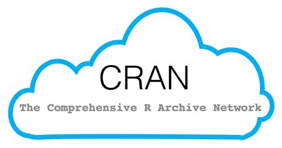
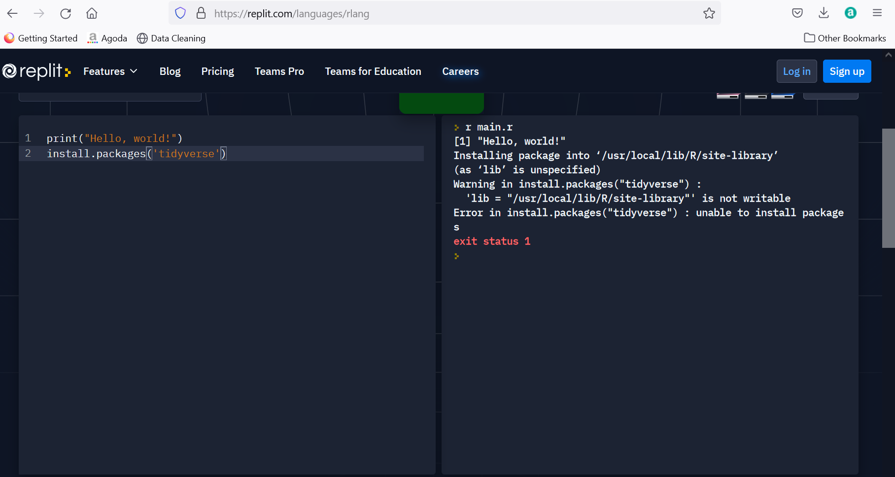
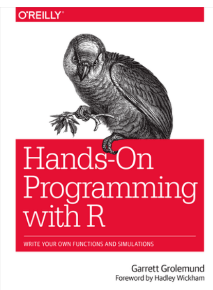
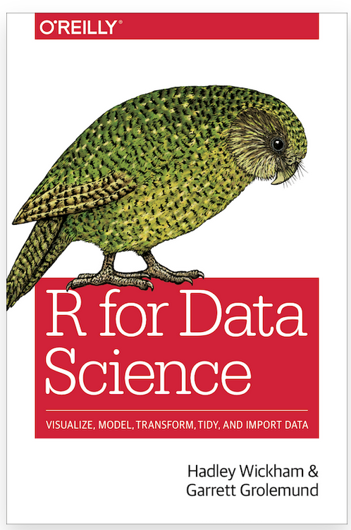
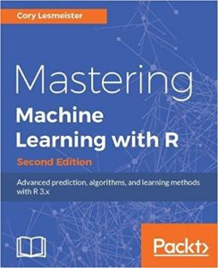
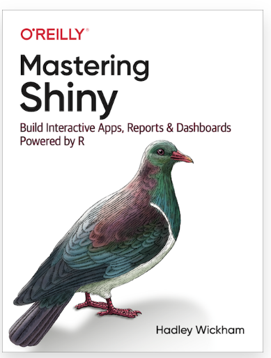
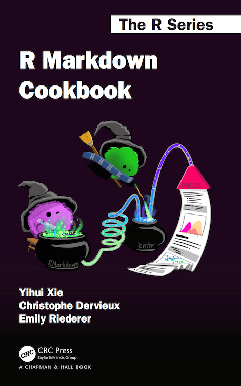

# Technologies I Use 

```{r echo = FALSE, fig.cap = "A Programmer Working on Some Code", fig.align = "center"}
knitr::include_graphics("images/maleProgrammer.jpg")
```

If you are going to work with me, then I think that it's only fair that you know the tools that I typically use during a hackathon.  Not only will this (hopefully) give you a rough idea of what to expect, but it'll also give you an idea of what to read up on.

The technologies that I typically use during each hackathon are^[Mind you - I don't necessarily use *all* technologies during each event.]:

1.  [R](#r)
1.  [Git](#vcs)
1.  [Shiny](#shiny)
1.  [R Markdown](#rmarkdown)

However, most importantly is that you are acquainted with technologies 1. and 3.  2. and 4. are still somewhat optional ^[Not knowing 2. and 4. would be like not knowing how to use a mixing stand.  You can definitely still bake a cake without ever having to know how to use one, but knowing how to use a mixing stand to make your cake batter would definitely be a lot more convenient!]; however, definitely read up on them nonetheless!

## R - the Statistical Programming Language {#r}

```{r echo = FALSE, fig.align = "center", fig.cap = "The Official Logo of the R Programming Language", out.width = "30%"}
knitr::include_graphics("images/rLogo.png")
```

If you are a SBS student, then you would have (or will) learn(ed) this language during *BS0004: Introduction to Data Science*.  However, the contents of that module are hardly sufficient for the work that I do during hackathons^[That is, assuming that you only knew as much R as there is in *BS0004*, you are going to have a **very** rough time under me if you don't bother to learn more about the language.].  

For that reason, I ask that in addition to revising the R that you've learned during *BS0004*, that you at least learn bother to read [the following books](#bookstoread) so that you don't become overwhelmed during the event itself.  Otherwise, if you have yet to take *BS0004*, then I will also list some beginner-friendly resources to learn grasp the basics of R.

### What is R?

R is a dialect of S.  That's all.  

#### Okay, so... what *is* S?

**S** is a statistical computing language developed at [Bell Laboratories](http://www.bell-labs.com/) some time during 1975 to 1976.  During the latter time period, much of statistical computing had been done using **FORTRAN**: a general purpose programming language that was especially used for scientific programming and number crunching.  Hence, S was created to provide a more interactive and a more intuitive approach to the aforementioned tasks.

When the first working version of S was made in 1976, it didn't have a name.  However, the language got its name via suggestions from the scientific community and the fact that the letter "S" was consistent with the names of other programming languages developed at Bell Laboratories (e.g., C).

```{r echo = F, fig.align = "center", fig.cap = "A Vintage Copy of the 1988 Blue Book", out.width = "30%"}

```

Needless to say, S has come a long way since its fruition in the late 1900s.  Some time in the late 1980s, the ***New S Language*** (i.e., the 1988 blue book - see above image) was published and had new features: for instance, the ability to pass functions to functions (i.e., first-class functions).  Many other changes were also introduced, including but not limited to the usage of X11 and PostScript graphics devices, the re-writing of many internal functions from FORTRAN to C, and the usage of double precision arithmetic.  

```{r echo = FALSE, fig.cap = "Ross Ihaka (left) and Robert Gentlemen (right) Receiving the Pickering Medal", fig.align = "center", out.width = "33%"}

```

In 1991, Ross Ihaka and Robert Gentlemen (i.e., the above two individuals) - statisticians from the University of Auckland - began working on a newer implementation of S.  R got its name as both statisticians' names begin with the letter "R".

Nevertheless, Ihaka and Gentlemen publicized their implementation on the data archive StatLib in 1993.  Only during 1995 did the statistician Martin Mächler convince Ihaka and Gentlemen to make R a free and open-source software under the GNU public license, effectively making 1995 the year the first version of R was released.

```{r echo = FALSE, fig.cap = "A User-Made Logo of the Comprehensive R Archive Network", fig.align = "center"}

```

R has been extensively developed since 1995.  In 1997, the **C**omprehensive **R** **A**rchive **N**etwork (or **CRAN** for short) was launched: an online repository of R's executable files, source code, documentations, and user-created packages.  CRAN currently has 101 mirrors and 18728 user-created packages.

During the same year, the **R core team** was also formed to further develop the language - the team currently consists of Ihaka, Gentlemen, and many other influential statisticians.  In 2003, the **R foundation** was formed as a non-profit organization to provide further support for developing R.

### Installing R and RStudio

In order to use R, you will need to have R installed onto your machine.  While there are R interpreters and code editors that are freely available on the internet, these editors are more suitable for fiddling around with R (i.e., you have some code that you want to try out or are new to the language and just want a quick and easy way of trying it out) than they are for machine learning or number crunching.  

```{r echo = FALSE, fig.cap = "An Online REPL Shell for R Displaying an Error", fig.align = "center"}

```

More importantly, however, is that the functionalities these editors provide are severely limited.  Not only will you be unable to save your work or install packages, but some base R functions may not work at all in these editors!

Fortunately, R comes shipped in different distributions depending on your computer's operating system.  I've listed several installation links below - click on the appropriate link to download R for your machine.  The installation instructions for R should be listed on the installations links themselves:

1.  [R for Windows](https://cran.r-project.org/bin/windows/base/)
1.  [R for MacOS](https://cran.r-project.org/bin/macosx/)
1.  [R for Linux](http://www.jason-french.com/blog/2013/03/11/installing-r-in-linux/)

Although only the R console is necessary to begin working with R, I'd highly recommend installing **RStudio** - an **I**ntegrated **D**evelopment **E**nvironment for R - as well.  RStudio is free and comes equipped with features such as:

1.  Syntax highlighting
1.  An object viewer
1.  Tools for [version control](#vc), plotting, and debugging.

You can download RStudio [here](https://www.rstudio.com/products/rstudio/) - just be sure to download *RStudio Desktop* and not *RStudio Server*!

### Resources to consult

I've listed several resources to consult to refresh or strengthen your knowledge of R.  Depending on how familiar or competent with the material presented in these books, you may or may not have to spend that much time with each one of them.

#### I've forgotten my R / never touched it before - where do I start?

Glad you asked - here are a couple of resources that you can consider consulting.

1.  **`swirl`** [(https://swirlstats.com/)](https://swirlstats.com/)

    **`swirl`** is a package developed by students at Johns Hopkins University to help R novices learn R in R^[Yeah, I know - this sounds like a paradox.].  `swirl` has content for topics from the bare basics of R (i.e., how do I print something out to the R console, how do I create a vector, etc.) to dealing with statistics in R; to use `swirl`, open up RStudio and type the following into your R console:
    
    ```{r eval = FALSE}
    install.packages("swirl")
    library(swirl)
    swirl()
    ```
    
    And once you've typed in and executed the above code, `swirl` will provide you with a set of instructions on what to do next!
    
1.  **Hands-On Programming with R** [(https://rstudio-education.github.io/hopr/index.html)](https://rstudio-education.github.io/hopr/index.html)

    ```{r echo = FALSE, fig.cap = "*Hands-On R Programming* by Garrett Grolemund", fig.align = "center", out.width = "40%"}
    
    ```
    
    This is a fun (albeit unconventional) introduction to R from one of my favorite book publishers.  In this book, the author aims to teach you R by coding several mini projects.
    
    While the content presented in this book is decent, not all of it will be very relevant for hackathons.  Chapters 2, 3, and 5 of the book are the most important to know^[So, if you don't have that much time, I'd suggest reading through those chapters at the very least].  
    
1.  **R Programming** [(https://www.coursera.org/learn/r-programming?specialization=jhu-data-science)](https://www.coursera.org/learn/r-programming?specialization=jhu-data-science)

    This MOOC from Johns Hopkins University is a supposed introduction to R.
    
    Even though this MOOC is meant to be a four-week introduction to R, it is still a very tough MOOC nonetheless!  However, it does make you a better programmer!
    
#### Doing stuff with R

The resources listed above are really only good for absolute beginners: people who know nothing about R and just want to get acquainted with the basics of the language.

If you already know the basics of R, then do check out these resources to get familiar with the tools that I use within R:

1.  **R for Data Science** [(https://r4ds.had.co.nz/)](https://r4ds.had.co.nz/)

    ```{r echo = FALSE, fig.cap = "*R for Data Science* by Hadley Wickham", fig.align = "center"}
    
    ```

    This book teaches you the basics of data science (miles better than *BS0004* does if you ask me) using the `tidyverse` functions.  This book is also especially great if you don't quite know what data science is or what a typical data science workflow looks like.  

    That said, the code shown in this book is drastically different from the above sources (and what *BS0004* teaches).  However, the code in this book is also reminiscent of the coding that I do, so *definitely* read this book!
    
1.  **Practical Machine Learning** [(https://www.coursera.org/learn/practical-machine-learning)](https://www.coursera.org/learn/practical-machine-learning)

    This is a four-week long MOOC on Coursera by Johns Hopkins University.  In this MOOC, you will learn to build machine learning models using the `caret` package.
    
    This MOOC is *super* tough, but also extremely rewarding once you do complete it.

1.  **Mastering Machine Learning with R**
    
    ```{r echo = FALSE, fig.cap = "*Mastering Machine Learning with R* by Cory Leimeister", fig.align = "center"}
    
    ```

    Most NLB libraries should have this book available.  Otherwise, you can head on over to [library genesis](https://libgen.li/) to search for this book!
    
    This book covers numerous machine learning algorithms that I think one ought to know (e.g., dimensionality reduction, regressions, clustering, business analytics, decision trees, etc).  It does not, however, make one an expert at machine learning - becoming an expert takes years of one's time and energy.  It does, however, provide you with a good foundation of machine learning.

1.  **Data Visualization in R with `ggplot2`** [(https://www.coursera.org/learn/jhu-data-visualization-r)](https://www.coursera.org/learn/jhu-data-visualization-r)

    If you've forgotten or don't know what `ggplot2` is, it's a package in R that helps you create presentation-worthy plots (i.e., if you are presenting your work in front of an audience, you can consider using `ggplot2` to make things look more presentable).  
    
    While this MOOC is also four-weeks long, it is also relatively chill.  I finished this course in one sitting.
    
## Git, the Version Control System {#vcs}

```{r echo = FALSE, fig.cap = "Git's Official Logo", fig.align = "center"}
knitr::include_graphics("images/git.png")
```

R is not the only tool that I use during hackathons and similar events.  I use **Git** to not only track changes that I've made to my code, but to also revert changes should something there ever be a need to undo something.  Git also makes collaborating with other programmers easier.

In case you are wondering, a **version control system** (or **VCS** for short) is software that allows you to save and track changes within one's code.

### Why should I even bother learning Git?

Let's imagine a scenario where you are a developer who works in a team that doesn't use Git.  Because of this, your team stores all of its developers' code in a single, shared folder which we will call `src` in this hypothetical scenario.

```{r echo = FALSE, fig.cap = "People Working in an Office", fig.align = "center", out.width = "50%"}

```

Nevertheless, it's a new day at the office and you are working on implementing some new and highly advanced features in a script file in `src` called `homepage.js`.  You shout this out to your fellow developers who are on the other side of the office.  They acknowledge your actions, get up from their desks, and head over to your company's break room for snacks and small talk while they wait for you to be done with your work.  

After five long excrutiating hours of non-stop coding, you somehow manage to implement those "new and highly advanced features".  So, you head to the break room to let your fellow developers know (assuming that they are still there) about this.  Your colleague tells you that they too have to make changes to `homepage.js`; so, they immediately get back to work, but in doing so, accidentally overwrites part of the code that you wrote during those five hours.  

```{r echo = FALSE, fig.cap = "An Angry Busineswoman Yelling at Her Subordinate", fig.align = "center", out.width = "50%"}

```

And so, they tell you about their accidental mistake.  You rage at them and also tell them to not work on `homepage.js` while you fix their mistake.  However, it's getting late: another developer needs to work on refactoring code inside `src`, but is unable to do anything but wait for you to finish fixing your colleague's mistake.  Another developer also needs to do work within `src`, but must also wait while you fix your colleague's mistake.  Eventually, you and your colleagues grow tired and frustrated; the team isn't making much progress on their project as only one developer can work on the code at any given moment (much to your manager's dismay).  Wouldn't it be better if there was a way for developers to work on the same set of files at the same time?

Git and other version control systems prevent all of the above from happening in the first place.  With Git, it won't matter if you and your colleagues are working on `header.js` at the same time - even if your colleague did remove your code by accident, he can very easily undo his mistakes without having to call you over or having to feel your rage.

### Installing Git 

You can install Git via this link: [https://git-scm.com/book/en/v2/Getting-Started-Installing-Git](https://git-scm.com/book/en/v2/Getting-Started-Installing-Git)

Git runs on MacOS, Linux, and Windows - depending on the operating system that you are using, there are different installation instructions listed in the link above.

### Learning Git

```{r echo = FALSE, fig.cap = "A Mentor and His Mentee Studying Code", fig.align = "center", out.width = "50%"}

```

There are plenty of resources on the internet for learning Git - here are just a few:

1.  **How to Use Git** [(https://phoenixnap.com/kb/how-to-use-git)](https://phoenixnap.com/kb/how-to-use-git)

    This is a great tutorial for getting started with Git.  Definitely read up on this first - make sure you know your Git commands well (i.e., `git push`, `git pull`, `git commit`, `git branch`, `git reset`, etc).
    
1.  **Commiting to Somebody Else's Repository** [(https://cmjchrisjones.dev/posts/contributing-to-someone-elses-git-repository/)](https://cmjchrisjones.dev/posts/contributing-to-someone-elses-git-repository/)

    As great as the first resource is, it does not explain how to work with others' repository (i.e., if you are working on a project by yourself, the first link is sufficient).  Since hackathons are typically collaborative, it's imperative that you know how to do the aforementioned - this blog post will show you how^[Like this resource mentions, please do *not* commit anything against the main repository.  If you do, I will revert your commit(s) and tell you to make pull request(s) instead.].
    
## Shiny - a Web Application Framework in R {#shiny}

```{r echo = FALSE, fig.cap = "Shiny's Official Logo", fig.align = "center", out.width = "50%"}
knitr::include_graphics("images/shiny.jfif")
```

**Shiny* is a framework written R for developing web applications.  The great thing about Shiny is that even without knowing much (or any) HTML, CSS, or JavaScript^[These languages are often referred to as the "holy trinity" - these are also languages that you must know if you are to work in web development one day], you can create published, complicated applications to showcase your work in an interactive manner.  Here is an example of a Shiny application by Yihui Xie^[Don't panic if the application is taking a long time to load - this is typical.]:

<center>
```{r echo = FALSE}
knitr::include_app("https://yihui.shinyapps.io/miniUI/",
  height = "500px")
```
</center>

Pretty cool, no?  If you ask me, Shiny is a step up from the traditional PowerPoint presentation (not that PowerPoint is inherently bad or anything).

### Learning Shiny

I do have two resource to recommend for learning Shiny, one of which is another book by Hadley Wickham and does a super job at introducing Shiny:

1.  **Mastering Shiny** [(https://mastering-shiny.org/)](https://mastering-shiny.org/)

    ```{r echo = FALSE, fig.cap = "*Mastering Shiny* by Hadley Wickham", fig.align = "center", out.width = "50%"}
    
    ```
    
    This is yet another book authored by Hadley Wickham - it's also how I first learned Shiny.  The book also serves as a good reference manual for doing things.
    
1.  **Shiny cheatsheet**

    If you are using RStudio, go to Help > Cheat Sheets > Web Applications with shiny.  
    
    This will open up a new browser window and a collection of tips in Shiny (for quick reference).
    
## R Markdown {#rmarkdown}

```{r echo = FALSE, fig.cap = "R Markdown's Official Logo", fig.align = "center", out.width = "40%"}
knitr::include_graphics("images/rmLogo.png")
```

**R Markdown** is a file format for making documents with R.  R markdown documents are written in **markdown** (a kind of markup language) and have chunk of embedded code.

While Shiny is capable of producing stunning applications, I sometimes integrate Shiny applications with markdown to enhance our team's Shiny application.  Otherwise, you can also do many things with R markdown (including this website) - a superbly handy feature of R markdown!

### Cool!  So, how do I begin learning R markdown?

For that, I recommend the following resources:

1.  **RStudio's Tutorial** [(https://rmarkdown.rstudio.com/lesson-1.html)](https://rmarkdown.rstudio.com/lesson-1.html)

    RStudio themselves has a tutorial on the bare basics of R Markdown.  It's not the most comprehensive guide there is, but it suffices for a start.
    
1.  **R Markdown Cookbook** [(https://bookdown.org/yihui/rmarkdown-cookbook/)](https://bookdown.org/yihui/rmarkdown-cookbook/)

    ```{r echo = FALSE, fig.cap = "*R Markdown Cookbook* by Yihui Xie and More", fig.align = "center", out.width = "50%"}
    
    ```

    On the topic of comprehensiveness, you can check out this book for a more comprehensive overview of how to use R Markdown.  Truth be told, I treat this book as more of a reference manual more than anything (i.e., if there's something I want to know how to do within R Markdown, this is my go-to book to consult, but I don't make an effort to remember that much from this book).
    
1.  **R Markdown: the Definitive Guide** [(https://bookdown.org/yihui/rmarkdown/)](https://bookdown.org/yihui/rmarkdown/)

    ```{r echo = FALSE, fig.cap = "*R Markdown: the Definitive Guide* by Yihui Xie and More", fig.align = "center", out.width = "50%"}
    
    ```

      You can use R markdown to display data in all sorts of ways.  This book will show you how!

1.  **R Markdown Cheatsheet**

    If you are using RStudio, then you can head to Help > Cheat Sheets > R Markdown Cheat Sheet for a PDF document on R Markdown syntax. 
    


